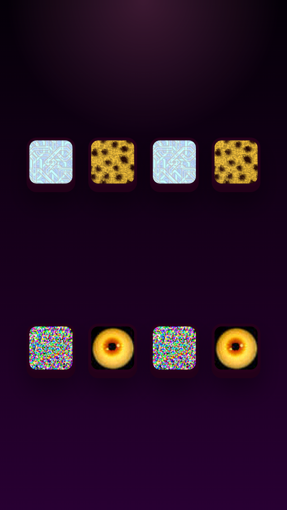

<h2 class="c-project-heading--task">Add another row</h2>

Add one more `wallpaper-row` inside the same `wallpaper` container so the pattern starts to spread.

<h2 class="c-project-heading--explainer">Make this change</h2>

Stay in `index.html` and put the new row underneath the first one.

--- code ---
---
language: html
filename: index.html
line_numbers: true
line_number_start: 9
line_highlights: 17-22
---
  <body>
    

      

        
        
        
        
      

      

        
        
        
        
      

    

  </body>
--- /code ---

## Now run your code

You should now see two rows of pattern images making a stronger wallpaper.

  

