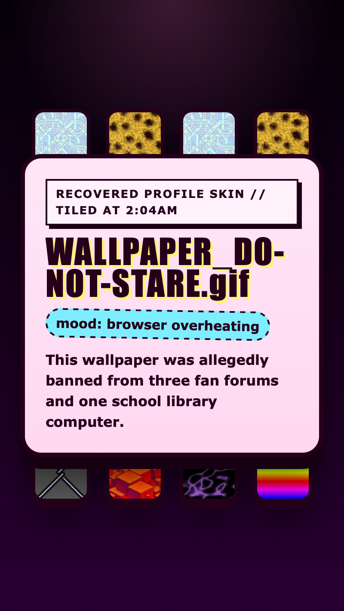

<h2 class="c-project-heading--task">Add the final rumour</h2>

Add one more paragraph inside the note panel so the wallpaper gets its dramatic warning message.

<h2 class="c-project-heading--explainer">Make this change</h2>

Stay in `index.html` and put the new paragraph underneath `
`.

--- code ---
---
language: html
filename: index.html
line_numbers: true
line_number_start: 31
line_highlights: 35
---
    <main class="pattern-note">
      
Recovered profile skin // tiled at 2:04am

      <h1>WALLPAPER_DO-NOT-STARE.gif</h1>
      
mood: browser overheating

      
This wallpaper was allegedly banned from three fan forums and one school library computer.

    </main>
--- /code ---

## Now run your code

You should now see the full warning note on top of the tiled pattern wallpaper.

  

